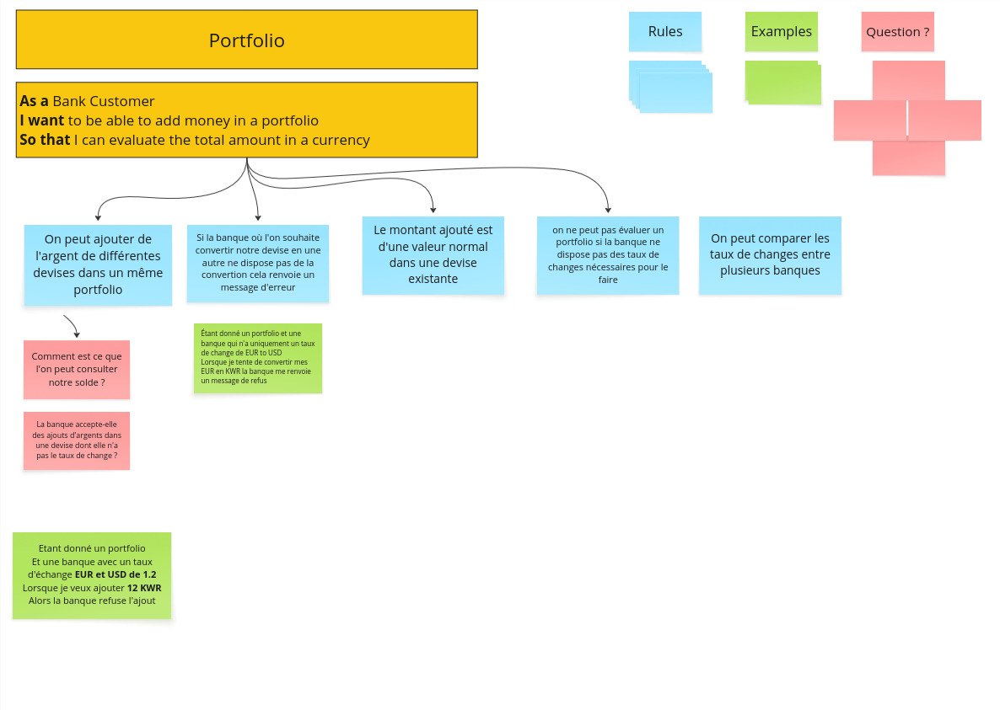

# Example Mapping

## Format de restitution
*(rappel, pour chaque US)*

```markdown
## Titre de l'US (post-it jaunes)

> Question (post-it rouge)

### Règle Métier (post-it bleu)

Exemple: (post-it vert)

- [ ] 5 USD + 10 EUR = 17 USD
```

Vous pouvez également joindre une photo du résultat obtenu en utilisant les post-its.

## Évaluation d'un portefeuille

> Comment est-ce que l'on peut consulter notre solde ?
> La banque accepte-elle des ajouts d'argents dans une devise dont elle n'a pas le taux de change ?
> Quels sont les devises que la banque accepte ?

### Règle Métier (post-it bleu)

> On peut ajouter de l'argent de différentes devises dans un même portfolio
> Le montant ajouté est d'une valeur normal dans une devise existante
> On ne peut pas évaluer un portfolio si la banque ne dispose pas des taux de changes nécessaires pour le faire
> On peut comparer les taux de changes entre plusieurs banques
> Si la banque où l'on souhaite convertir notre devise en une autre ne dispose pas de la convertion cela renvoie un message d'erreur

Exemple: (post-it vert)

- [ ] Étant donné un portfolio et une banque qui n'a uniquement un taux de change de EUR to USD
Lorsque je tente de convertir mes EUR en KWR la banque me renvoie un message de refus
- [ ] Etant donné un portfolio et une banque avec un taux d'échange EUR et USD de 1.2. Lorsque je veux ajouter 12 KWR, alors la banque refuse l'ajout

- [ ] 5 USD + 10 EUR = 17 USD

## Image
